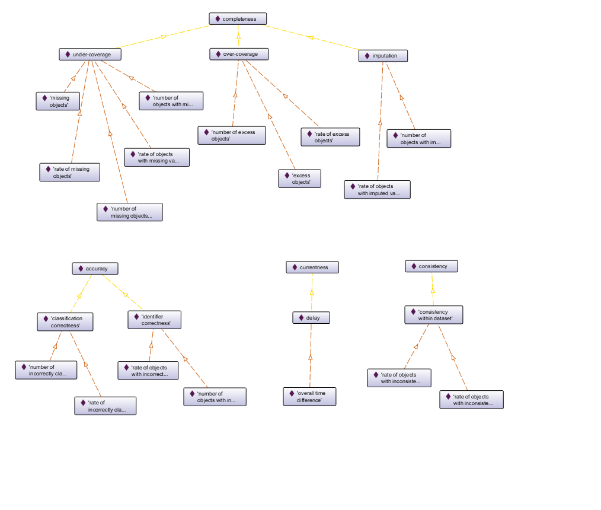

# dqvno

For forvaltning av ontologien for DQV-AP-NO (norsk profil av DQV).

Lenke: https://data.norge.no/vocabulary/dqv-ap-no

Vokabularet inneholder p.t. predefinerte kvantifiserbare kvalitet (kvalitetsmål, dqv:Metric) og tilhørende kvalitetsdimensjoner og -deldimensjoner (dqv:Dimension), samt dqvno:erAutoritativ (dqv:QualityAnnotation) (det sistnevnte vises ikke i figuren under).

\- _Digitaliseringsdirektoratet / Norwegian Digitalisation Agency (https://digdir.no)_
