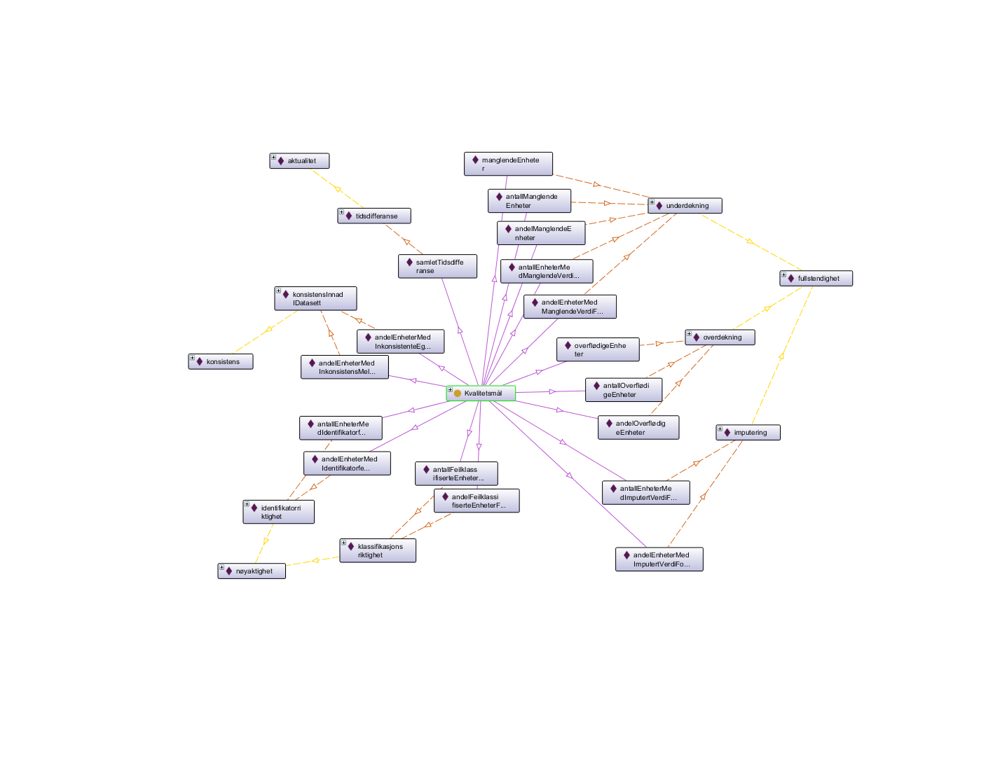

# dqvno

For forvaltning av kontrollerte vokabularer knyttet til dqv-ap-no (norsk profil av DQV). 

Vokabularet inneholder p.t. predefinerte kvantifiserbare kvalitet (kvalitetsmål, dqv:Metric) og tilhørende kvalitetsdimensjoner og -deldimensjoner (dqv:Dimension), samt dqvno:erAutoritativ (dqv:QualityAnnotation) (det sistnevnte vises ikke i figuren under). 

\- _Digitaliseringsdirektoratet / Norwegian Digitalisation Agency (https://digdir.no)_ 
